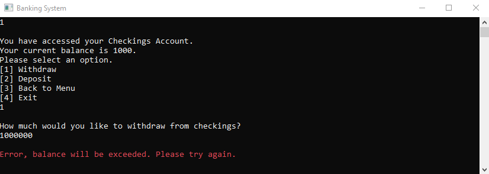
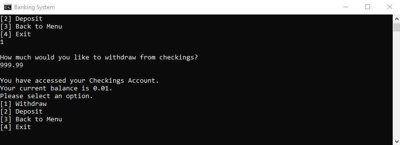
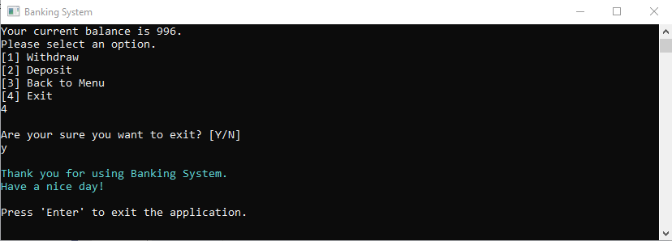

# Banking System
Command-line banking system, with navigational menus and error handling.
This is a .NET application. Executable file is located in the bin directory.

1. Incorrect inputs are rejected until correct, including not allowing user to exceed balances.
```csharp
    Console.WriteLine("\nHow much would you like to withdraw from checkings?");
    string withdrawAmount = Console.ReadLine();
    decimal withdraw = Decimal.Parse(withdrawAmount);
    while (withdraw > checkings)
    {
        Console.ForegroundColor = ConsoleColor.Red;
        Console.WriteLine("\nError, balance will be exceeded. Please try again.");
        Console.ForegroundColor = ConsoleColor.White;
        withdrawAmount = Console.ReadLine();
        withdraw = Decimal.Parse(withdrawAmount);
    }
```


2. Previous menus can be returned to.


3. Bankers rounding method is utilized to avoid inappropriate currency calculations.
If user would like to withdraw $999.99 out of $1000, the program will respond correctly with $0.01 balance remaining.


4. User is asked to confirm program exit.

